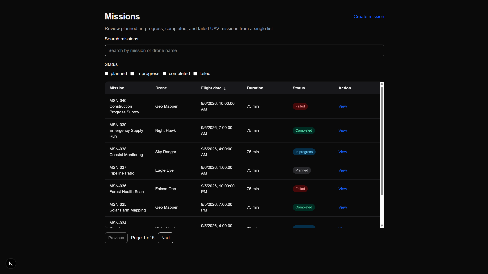
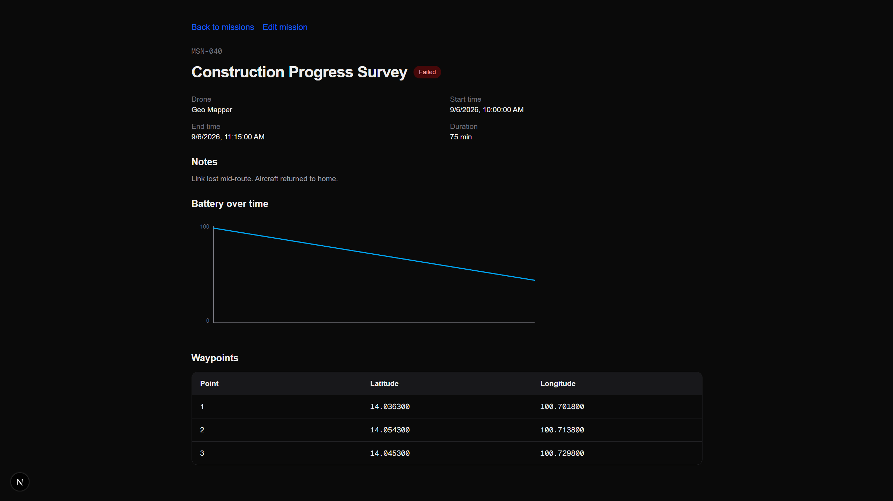
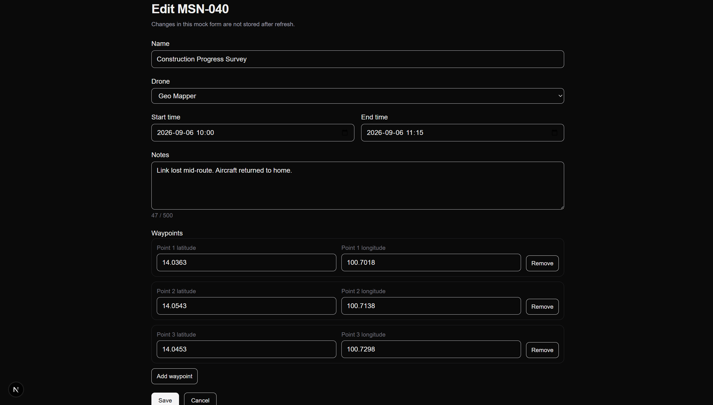
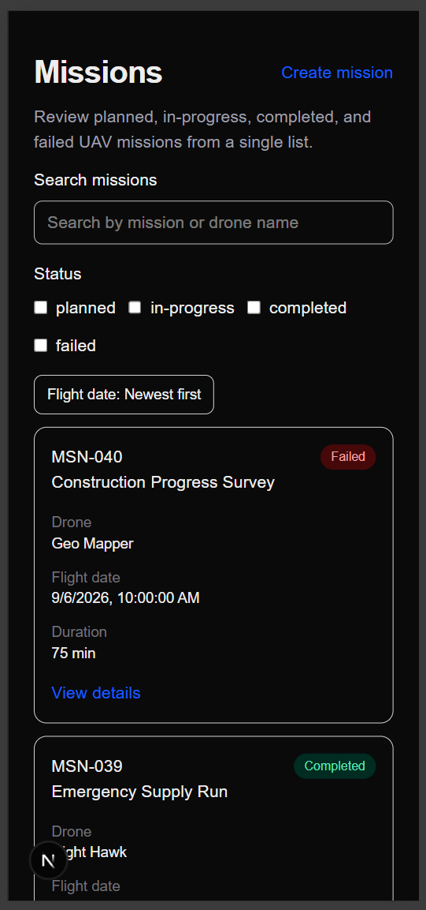

# UAV Mission Dashboard

A mock front-end dashboard for reviewing UAV missions. It lists 40 sample flights, shows mission detail with waypoints and battery history, simulates live telemetry for in-progress flights, and provides create/edit forms. Data comes from a delayed mock API and is not stored on a server.

## Features

- Mission list with search, filters, sorting, and pagination
- Mission details and waypoints
- Battery chart
- Simulated real-time telemetry
- Create and edit mission forms
- Responsive design

## Screenshots

### Mission list

Search, status filters, sortable flight date, and pagination.

### Mission details

Notes, battery chart, and waypoints.

### Create and edit form

Shared form with validation, notes counter, and dynamic waypoints.

### Responsive layout

On small screens the list switches from a table to cards.

## Requirements

- Node.js 20.9 or later
- npm

## Installation

1. Clone this repository
2. Run `npm install`
3. Run `npm run dev`
4. Open [http://localhost:3000/missions](http://localhost:3000/missions)

## Available Scripts

- `npm run dev` — start the Next.js development server
- `npm run lint` — run ESLint
- `npm run build` — create a production build
- `npm run start` — serve the production build

## Mock API

Routes live under `src/app/api/missions` and read from `src/data/missions.ts`. There is no database.

**`GET /api/missions`**

- Waits 500 ms, then returns `{ data, total }` for all 40 missions.
- Add `?error=true` to simulate a failure: HTTP 500 with `{ message: "Unable to load missions" }`.

**`GET /api/missions/[id]`**

- Waits 500 ms, then returns `{ data }` for that mission.
- Unknown ids return HTTP 404 with `{ message: "Mission not found" }`.

The list page uses the collection endpoint. Detail and edit pages use the `[id]` endpoint. Search, status filters, sort, and pagination run in the browser after the full list is loaded.

## Known Limitations

Create and edit are front-end only. Save validates the form, waits 700 ms, and shows a success message. New or changed missions are not written to the mock data, so a refresh returns the original 40 missions.

Live telemetry exists only on in-progress missions. It updates in the browser every 1.5 seconds and is discarded when you leave the detail page.
